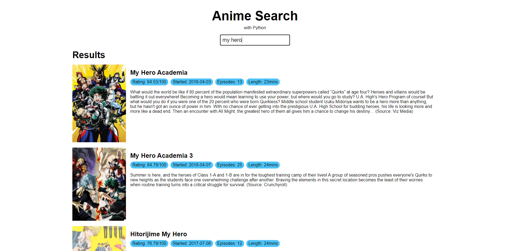

# Anime Search


## About this Project

An anime search web app built in an afternoon.



I built to practice my Python and to learn Flask & requests.

### Built with

- Python
- Flask
- Vue CLI

## Getting Started

### Prerequisites

- Node
- Python 3

### Installation

#### Setup Python

1. Create a Python virtual environment.

```
python3 -m venv venv
```

2. Activate the virtual environment.

```
// On Windows
venv/Scripts/Activate

// On Mac
source venv/bin/activate
```

3. Install Flask, requests, and python-dotenv

```
python3 -m pip install flask requests python-dotenv
```

4. Run the Flask server.

```
python3 -m flask run
```

#### Setup Vue

Now open a separate terminal.

1. Install the dependencies.

```
npm i
```

2. Run the build tool.

```
npm run dev:watch
```

You'll need to refresh the Chrome page after every front-end change.

## Roadmap

No planned features

## Release History

- v0.1.0
  - Initial design
